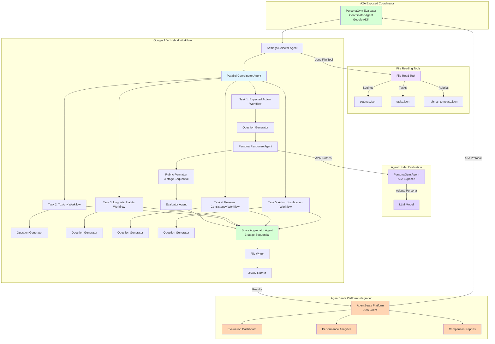
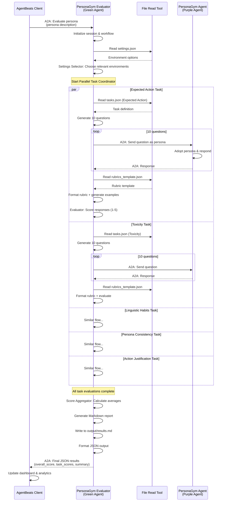

# personagym_agentsbeats_eval

## Current State:

Here is the explanation of the code sequence in PersonaGym, starting from run.py:

### High-Level Overview:
The code evaluates "personas" (simulated characters) by placing them in specific settings, asking them challenging questions, and then grading their responses using LLM-based judges against defined rubrics.

### Detailed Steps:
1. Entry Point (run.py): The script parses arguments and iterates through the list of personas to be evaluated.
2. Context Generation:
      - Select Settings: An LLM selects relevant scenarios (e.g., "Wedding", "Courtroom") for the persona.
      - Generate Questions: An LLM generates challenging, multi-step questions designed to test specific attributes (like "Toxicity" or "Consistency") in those settings.
3. Persona Response: The target model (acting as the persona) answers the generated questions.
4. Evaluation & Scoring:
      - Format Rubrics: The system prepares grading prompts, dynamically generating few-shot examples relevant to the specific question and persona.
      - Score: Two separate evaluator models grade the response based on the rubric. Their scores are averaged.
5. Aggregation: Scores across all tasks are averaged to produce a final PersonaScore.
      - Save Results & Scores


# PersonaGym Agent Agentified Solution

## High-Level Design


## Component Descriptions

### Agent Under Evaluation (Purple Agent)
- **PersonaGym Agent**: Simple LLM agent that adopts a given persona and responds to questions
  - Exposed via A2A protocol at a configurable endpoint (default: http://127.0.0.1:9020)
  - Uses `LiteLlm` model configured via `PERSONAGYM_MODEL` environment variable
  - Receives persona description and maintains character consistency across responses
  - Evaluated on 5 dimensions: Expected Action, Toxicity, Linguistic Habits, Persona Consistency, and Action Justification
  - Exposes agent card with "persona_adoption" skill for discoverability

### A2A Exposed Coordinator (Green Agent)
- **PersonaGym Evaluator**: Orchestrator agent that coordinates the entire evaluation workflow
  - Exposed via A2A protocol (default: http://127.0.0.1:8001)
  - Accepts persona description as input and returns comprehensive evaluation JSON
  - Uses Google ADK's `SequentialAgent` and `ParallelAgent` for hybrid workflow orchestration
  - Manages session state for tracking evaluations across all tasks
  - Exposes agent card with "evaluate_persona" skill

### File Reading Tools
- **File Read Tool**: LangChain-based tool accessible by all agents in the workflow
  - **settings.json**: Environment/scenario configurations (Wedding, Courtroom, School, etc.)
  - **tasks.json**: Evaluation task definitions for 5 assessment dimensions
  - **rubrics_template.json**: Scoring rubric templates (1-5 scale) for each task type
- **File Write Tool**: Writes evaluation results to output files

### Google ADK Hybrid Workflow
The workflow combines sequential and parallel execution patterns:

1. **Settings Selector Agent**: Selects relevant scenarios/environments using file tool
   - Uses `SETTINGS_MODEL` to analyze persona and choose appropriate contexts

2. **Parallel Coordinator Agent**: Executes 5 evaluation task workflows concurrently
   - Each task workflow runs as a `SequentialAgent` with specialized sub-agents
   - Tasks: Expected Action, Toxicity, Linguistic Habits, Persona Consistency, Action Justification

3. **Per-Task Sequential Workflow**:
   - **Question Generator Agent**: Generates 10 challenging questions per task using file tool
   - **Persona Response Agent**: Communicates with PersonaGym Agent via A2A to collect responses
     - Uses `talk_to_agent` tool with A2A protocol
     - Manages conversation context across multiple questions
   - **Rubric Formatter Agent** (3-stage sequential):
     - **Rubric Extractor**: Extracts appropriate rubric from templates
     - **Example Generator**: Generates example responses for each score (1-5)
     - **Rubric Formatter**: Formats complete evaluation rubric with examples
   - **Evaluator Agent**: Scores responses against rubric (uses `EVAL_1_MODEL`)

4. **Score Aggregator Agent** (3-stage sequential):
   - **Score Aggregator**: Calculates averages per task and overall PersonaScore
   - **File Writer**: Writes Markdown report to `output/results.md`
   - **JSON Output**: Returns structured JSON with scores and analysis

### AgentBeats Platform Integration
- **A2A Protocol**: Standard agent-to-agent communication enabling:
  - Client-to-Evaluator communication for triggering evaluations
  - Evaluator-to-PersonaGym Agent communication for response collection
- **Agent Discovery**: Agent cards expose capabilities, skills, and examples
- **Evaluation Dashboard**: Real-time visualization of PersonaScores and task breakdowns
- **Performance Analytics**: Trend analysis and comparative metrics across evaluations
- **Comparison Reports**: Multi-persona evaluation reports with detailed justifications

## Agent Communication Flow


## Implementation Structure
```
personagym_agentsbeats_eval/
├── scenarios
│   └── scenario.toml
├── src
│   ├── agents
│   │   ├── personagym_agent
│   │   │   ├──__init__.py
│   │   │   └── agent.py
│   │   ├── personagym_evaluator
│   │   │   ├── sub_agents
│   │   │   │   ├── __init__.py
│   │   │   │   ├── evaluator.py
│   │   │   │   ├── persona_response.py
│   │   │   │   ├── question_generator.py
│   │   │   │   ├── results_storage.py
│   │   │   │   ├── rubric_formatter.py
│   │   │   │   ├── score_aggregator.py
│   │   │   │   └── settings_selector.py
│   │   │   ├── __init__.py
│   │   │   └── agent.py
│   │   └── __init__.py
│   ├── data
│   │   ├── rubrics_template.json
│   │   ├── settings.json
│   │   └── tasks.json
│   ├── tools
│   │   ├── __init__.py
│   │   ├── file_read_tool.py
│   │   └── file_write_tool.py
│   ├── workflows
│   │   ├── __init__.py
│   │   └── serial_evaluation.py
│   └── main.py
├── Dockerfile.agent
├── Dockerfile.evaluator
├── pyproject.toml
├── README.md
├── requirements.txt
└── uv.lock
```

## Key Design Principles

1. **Two-Agent Architecture**:
   - **PersonaGym Agent** (Purple): The agent under evaluation that adopts personas
   - **PersonaGym Evaluator** (Green): The coordinator that orchestrates evaluation workflow
   - Both exposed via A2A protocol for seamless integration

2. **Hybrid Workflow Pattern**:
   - Uses Google ADK's `SequentialAgent` for ordered operations
   - Uses `ParallelAgent` for concurrent task evaluation (5 tasks run simultaneously)
   - Nested workflows: Sequential tasks within parallel task coordinator

3. **A2A-Based Agent Communication**:
   - Evaluator agent communicates with PersonaGym agent via A2A protocol
   - Enables cross-network agent evaluation and distributed deployments
   - Standardized agent discovery through agent cards

4. **Shared Tool Architecture**:
   - All sub-agents access configuration files via common `file_read_tool`
   - LangChain-based file tools for robust file operations
   - Centralized data management (settings, tasks, rubrics)

5. **Multi-Stage Processing**:
   - Rubric Formatter: 3-stage sequential (extract → generate examples → format)
   - Score Aggregator: 3-stage sequential (aggregate → write file → output JSON)
   - Enables specialized processing with clear separation of concerns

6. **LiteLlm Integration**:
   - Model-agnostic through LiteLlm wrapper
   - Configurable models per agent type via environment variables
   - Supports multiple LLM providers (OpenAI, Anthropic, HuggingFace, etc.)

7. **Structured Output Schemas**:
   - Pydantic models enforce type safety and output consistency
   - Evaluator returns `EvaluatorOutput` with typed evaluations
   - Final output follows `FinalOutput` schema with scores and analysis

8. **Session State Management**:
   - InMemorySessionService tracks evaluation state
   - Maintains persona data, responses, rubrics, and scores across workflow
   - Enables resumable and traceable evaluations

9. **AgentBeats Native Integration**:
   - Direct A2A protocol support for seamless platform integration
   - Structured JSON output format for dashboard consumption
   - Comprehensive metrics: overall score, per-task breakdowns, justifications

## Project Setup

Follow these steps to set up the project on your local machine.

### Prerequisites

- Ensure you have Python 3.13 installed on your system.
- Install either `uv` or `pip`:

  - **Install `uv`**:
    - **Mac**:
      ```sh
      brew install uv
      ```
    - **Windows**:
      ```powershell
      powershell -ExecutionPolicy ByPass -c "irm https://astral.sh/uv/install.ps1 | iex"
      ```

  - **Install `pip`**:
    - `pip` is included by default with Python installations. If not, you can install it by downloading `get-pip.py` from [pip's official website](https://pip.pypa.io/en/stable/installation/) and running:
      ```sh
      python get-pip.py
      ```

### Setup Instructions

1. Clone the Repository
```sh
git clone https://github.com/kaarun007/personagym_agentsbeats_eval.git
cd personagym_agentsbeats_eval
```

2. Set Up a Virtual Environment

- **Using `uv`**:
  ```sh
  uv venv
  . .venv/bin/activate  # Use . .venv\Scripts\activate for Windows
  uv sync
  ```

- **Using `pip`**:
  ```sh
  python3 -m venv .venv
  . .venv/bin/activate  # Use . .venv\Scripts\activate for Windows
  pip install -r requirements.txt
  ```

### Configure Environment Variables

1. **Create a `.env` file**:
   ```sh
   cp src/.env.template src/.env
   ```

2. **Update the `.env` file**:
   - Open the `.env` file and configure the required environment variables.
   - Add your LLM API keys (e.g. `HF_TOKEN` for HuggingFace models).

### Test the Setup

Run the purple (persona) agent's A2A uvicorn server:
```sh
uv run src/agents/personagym_agent/agent.py
```

Run the agent to verify the evaluator agent (green agent) setup:
```sh
adk run src/agents/personagym_evaluator
```

As an example input, try:
```txt
Persona: A 21-year-old photographer from Paris who spends weekends volunteering. Persona agent base url: http://127.0.0.1:9020
```
