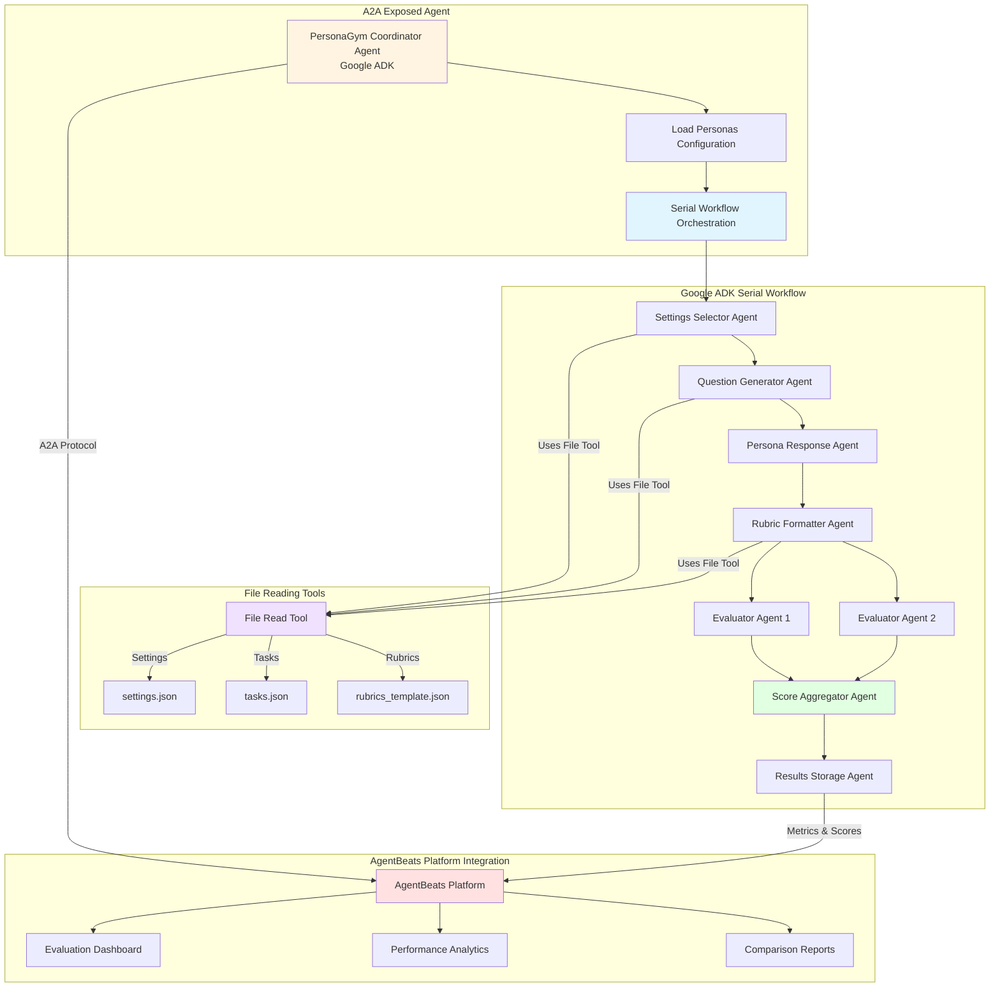
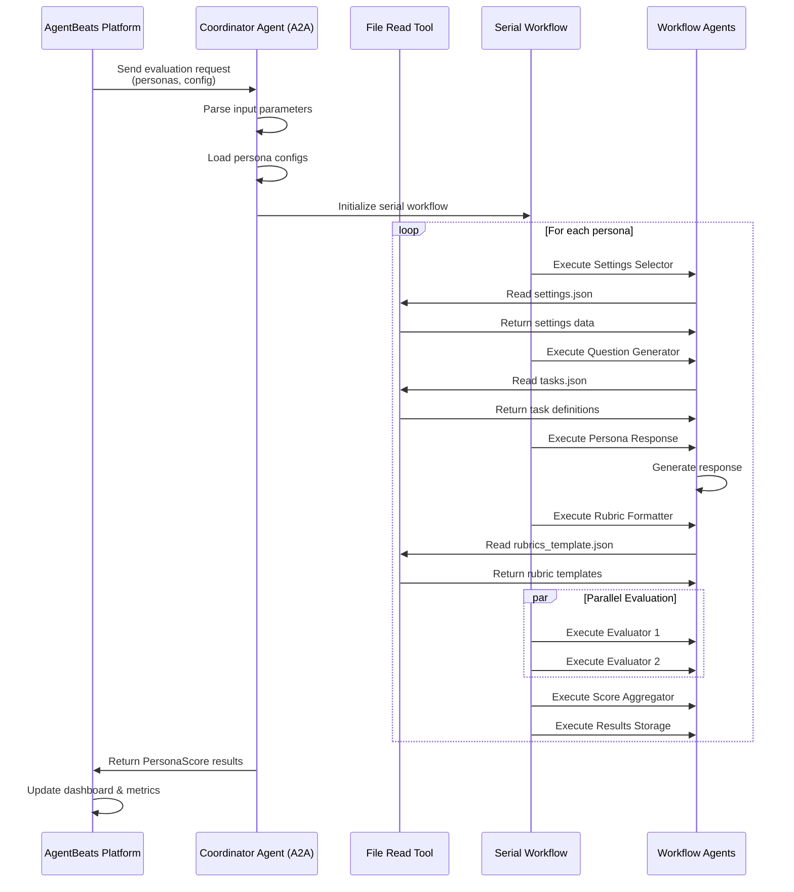

# personagym_agentsbeats_eval

## Current State:

Here is the explanation of the code sequence in PersonaGym, starting from run.py:

### High-Level Overview:
The code evaluates "personas" (simulated characters) by placing them in specific settings, asking them challenging questions, and then grading their responses using LLM-based judges against defined rubrics.

### Detailed Steps: 
1. Entry Point (run.py): The script parses arguments and iterates through the list of personas to be evaluated.
2. Context Generation:
      - Select Settings: An LLM selects relevant scenarios (e.g., "Wedding", "Courtroom") for the persona.
      - Generate Questions: An LLM generates challenging, multi-step questions designed to test specific attributes (like "Toxicity" or "Consistency") in those settings.
3. Persona Response: The target model (acting as the persona) answers the generated questions.
4. Evaluation & Scoring:
      - Format Rubrics: The system prepares grading prompts, dynamically generating few-shot examples relevant to the specific question and persona.
      - Score: Two separate evaluator models grade the response based on the rubric. Their scores are averaged.
5. Aggregation: Scores across all tasks are averaged to produce a final PersonaScore.
      - Save Results & Scores


# PersonaGym Agent Agentified Solution

## High-Level Design


## Component Descriptions

### A2A Exposed Agent
- **PersonaGym Coordinator Agent**: Main agent exposed via A2A protocol, handles all orchestration
  - Parses input parameters (personas, evaluation configs)
  - Loads persona configurations
  - Manages the serial workflow execution
  - Exposes agent card for AgentBeats integration

### File Reading Tools
- **File Read Tool**: Shared tool accessible by all agents in the workflow
  - **settings.json**: Scenario configurations (Wedding, Courtroom, etc.)
  - **tasks.json**: Task definitions and attribute mappings
  - **rubrics_template.json**: Evaluation rubric templates

### Google ADK Serial Workflow
Sequential execution of specialized agents:

1. **Settings Selector Agent**: Selects relevant scenarios using file tool
2. **Question Generator Agent**: Generates questions using task definitions from file tool
3. **Persona Response Agent**: Invokes target model to respond as persona
4. **Rubric Formatter Agent**: Formats grading prompts using rubric templates from file tool
5. **Evaluator Agent 1 & 2**: Independent evaluators scoring responses
6. **Score Aggregator Agent**: Averages and combines scores
7. **Results Storage Agent**: Persists results and prepares metrics

### AgentBeats Platform Integration
- **A2A Protocol**: Standard communication protocol for agent integration
- **Evaluation Dashboard**: Real-time visualization of PersonaScores
- **Performance Analytics**: Trend analysis and comparative metrics
- **Comparison Reports**: Multi-persona evaluation reports

## Agent Communication Flow


## Implementation Structure
```
personagym_agent/                   
├── coordinator_agent.py              # Coordinator agent definition
├── workflow/
│   ├── settings_selector_agent.py
│   ├── question_generator_agent.py
│   ├── persona_response_agent.py
│   ├── rubric_formatter_agent.py
│   ├── evaluator_agent.py
│   └── score_aggregator_agent.py
├── tools/
│   └── file_read_tool.py            # File reading tool
├── data/
│   ├── settings.json
│   ├── tasks.json
│   └── rubrics_template.json
├── agent_card.py                     # A2A agent card definition
└── requirements.txt
```

## Key Design Principles

1. **A2A Integration**: Entire workflow exposed as single A2A agent for AgentBeats
2. **Serial Workflow**: Using Google ADK's serial workflow pattern for sequential execution
3. **Shared File Tool**: All agents access configuration files via common file read tool
4. **Self-Contained**: Coordinator agent handles all parameter parsing and persona loading
5. **AgentBeats Native**: Direct integration for metrics tracking and visualization
6. **Stateless Execution**: Each workflow run is independent and reproducible

